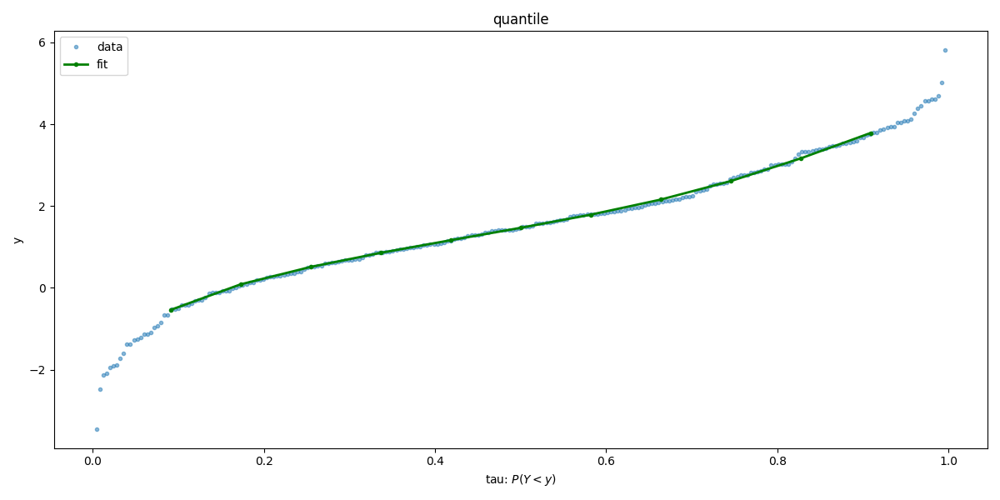
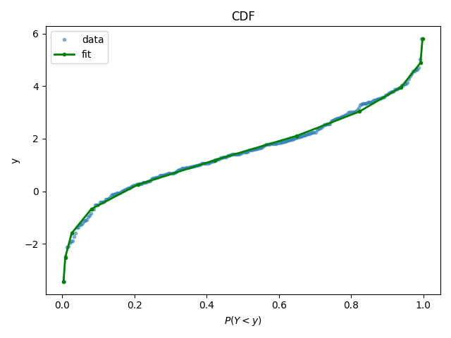
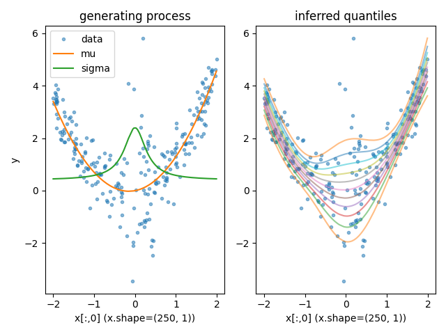
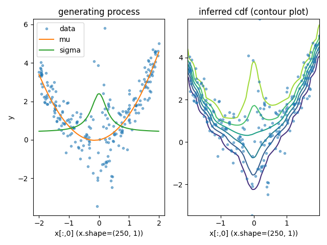

# Quantile and CDF Regression Example

Quantile regression objective

$$ J(\tau) = E\left(\rho(\tau, Y - u(\tau, X)|X\right)$$

CDF regression objective

$$ J(y_c) = E\left(1_{Y < y_c} \log v(y_c, X) + (1 - 1_{Y < y_c}) \log(1 - v(y_x, X)) | X\right)$$

The functions $u$, $v$ must be monotonic in $\tau$ and $y_c$ respectively.

## Unconditional distribution of $Y$

### Quantile regression

### CDF estimation via logistic regression with monotone network

## Conditional distributional of $Y|X$

### Quantile regression

### CDF estimation via logistic regression with monotone network

# TODO

Do more quantitative error plots etc.
