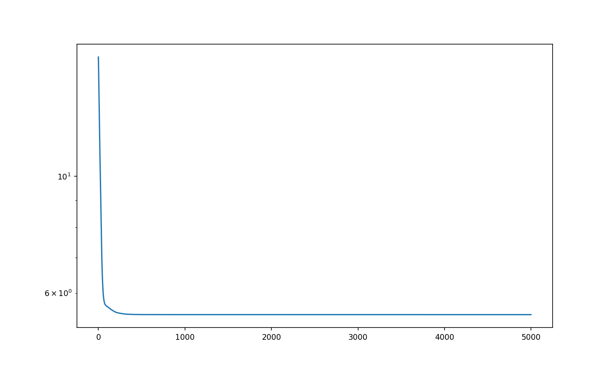
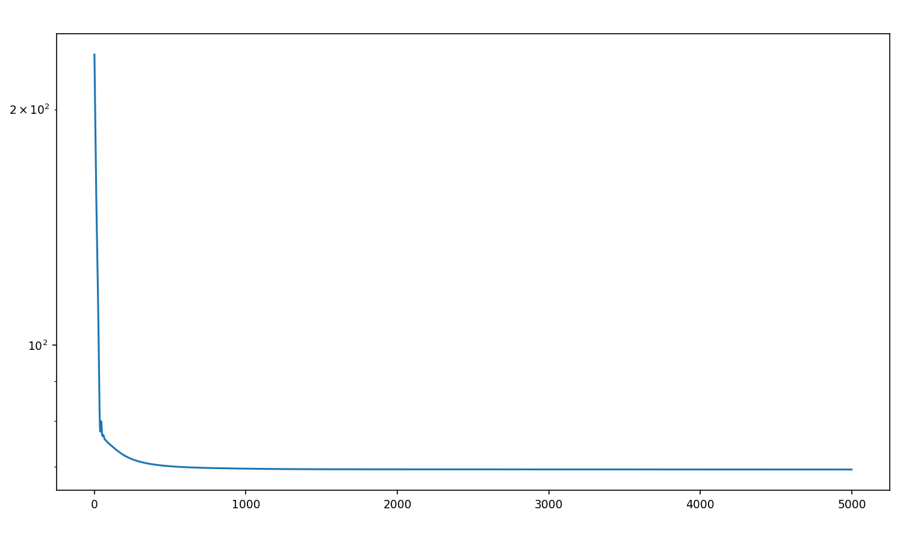
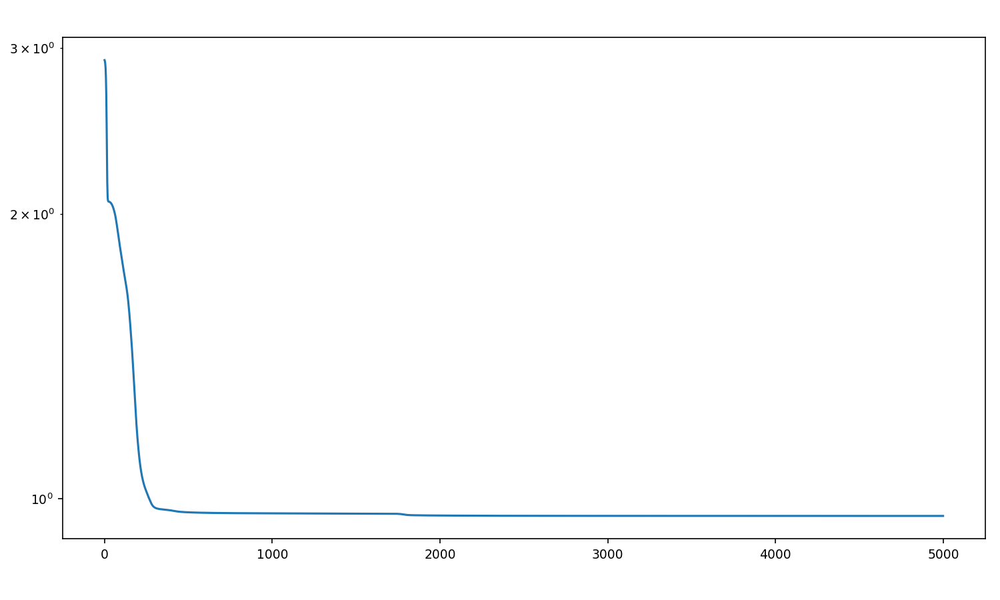
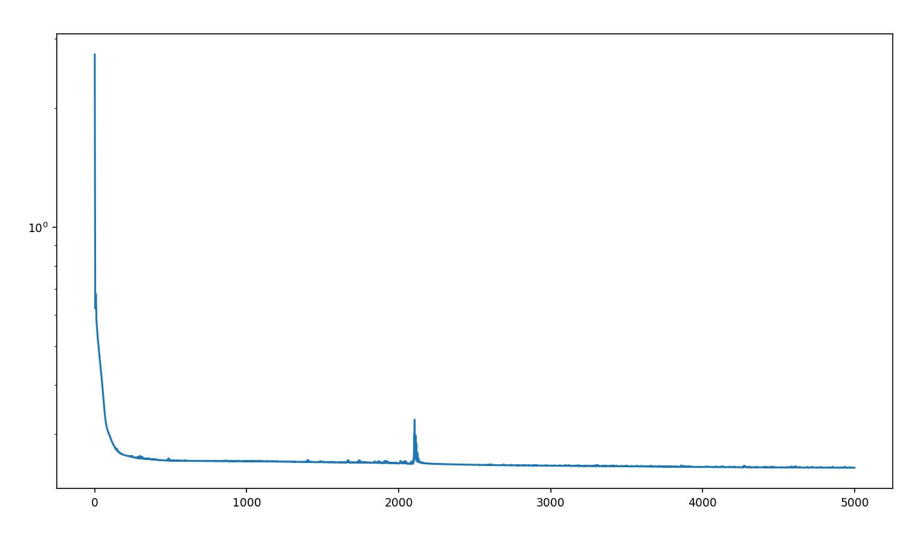
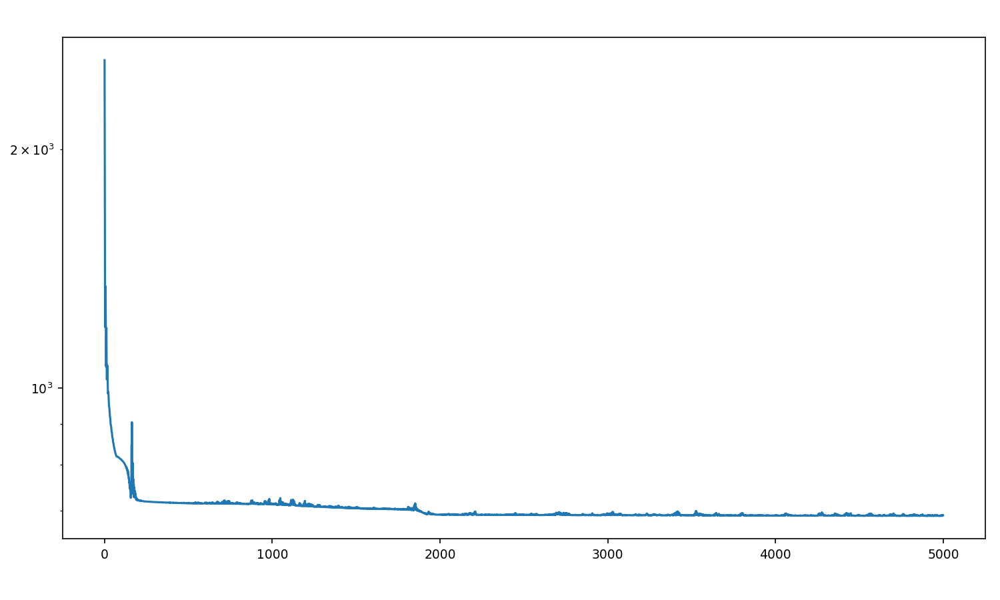
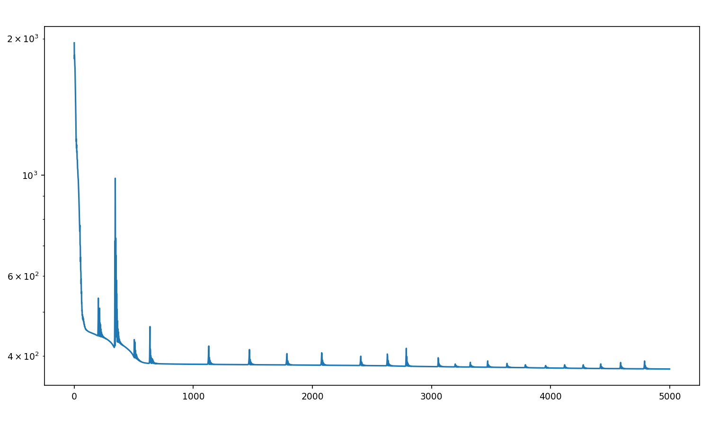
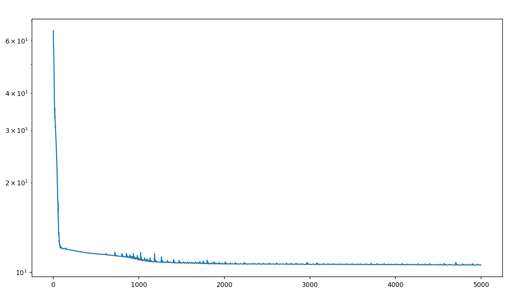

# Quantile and CDF Regression Example

### Quantile Regression Objective
$$ J(\tau) = E\left(\rho(\tau, Y - u(\tau, X)|X\right)$$

### CDF Regression Objective
$$ J(y_c) = E\left(1_{Y < y_c} \log v(y_c, X) + (1 - 1_{Y < y_c}) \log(1 - v(y_x, X)) | X\right)$$

The functions $u$, $v$ must be monotonic in $\tau$ and $y_c$ respectively.

## Unconditional Distribution of $Y$

### Quantile Regression

<table>
<tr>
  <td><b>TensorFlow</b></td>
  <td><b>JAX</b></td>
  <td><b>PyTorch</b></td>
</tr>
<tr>
  <td></td>
  <td></td>
  <td></td>
</tr>
<tr>
  <td></td>
  <td></td>
  <td></td>
</tr>
</table>

### CDF Estimation via Logistic Regression with Monotone Network

<table>
<tr>
  <td><b>TensorFlow</b></td>
  <td><b>JAX (logistic)</b></td>
  <td><b>JAX (CRPS)</b></td>
  <td><b>PyTorch (logistic)</b></td>
  <td><b>PyTorch (CRPS)</b></td>
</tr>
<tr>
  <td></td>
  <td></td>
  <td></td>
  <td></td>
  <td></td>
</tr>
<tr>
  <td></td>
  <td></td>
  <td></td>
  <td></td>
  <td></td>
</tr>
</table>

## Conditional Distribution of $Y|X$

### Quantile Regression

<table>
<tr>
  <td><b>TensorFlow</b></td>
  <td><b>JAX</b></td>
  <td><b>PyTorch</b></td>
</tr>
<tr>
  <td></td>
  <td></td>
  <td></td>
</tr>
<tr>
  <td></td>
  <td></td>
  <td></td>
</tr>
</table>

### CDF Estimation via Logistic Regression with Monotone Network

<table>
<tr>
  <td><b>TensorFlow</b></td>
  <td><b>JAX (logistic)</b></td>
  <td><b>JAX (CRPS)</b></td>
  <td><b>PyTorch (logistic)</b></td>
  <td><b>PyTorch (CRPS)</b></td>
</tr>
<tr>
  <td></td>
  <td></td>
  <td></td>
  <td></td>
  <td></td>
</tr>
<tr>
  <td></td>
  <td></td>
  <td></td>
  <td></td>
  <td></td>
</tr>
</table>

## TODO

- do more quantitative error plots etc.
- normalizing flows ... i.e. round trip cdf and quantile as consistency constraint ... where is this done, is it actually doing anything to include this constraint.
- randomize $\tau$ sampling during training in jax instead of grid ...
- regularization/calibration/conformal prediction
- review the translation to jax and make sure arch is actually the same as tf
- make sure data is pure and deterministic across envs
